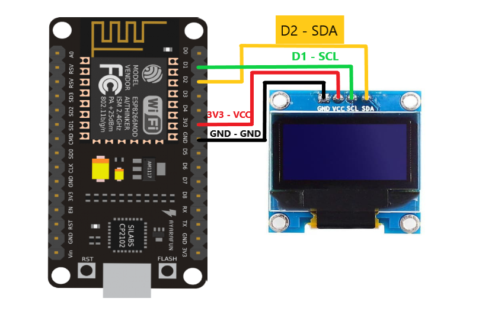

# ZeroTwin 1.0

 

    

<b>ESP8266 EvilTwin &amp; deauther all-in-one WiFi pen-testing tools</b> 
Easy to modify, customize captive portal, and integration with 0.96 inch OLED 

  
Table of Contents

  <ol>
    <li>
      <a href="#about-the-project">About The Project</a>
      <ul>
        <li><a href="#disclaimer">Disclaimer</a></li>
        <li><a href="#conclusion">Conclusion</a></li>
      </ul>
    </li>
    <li>
      <a href="#getting-started">Getting Started</a>
      <ul>
        <li><a href="#prerequisites">Prerequisites</a></li>
        <li><a href="#installation">Installation</a></li>
      </ul>
    </li>
    <li>
    <a href="#usage">Usage</a>
          <ul>
        <li><a href="#diagram">Diagram</a></li>
        <li><a href="#wiring">Wiring</a></li>
        <li><a href="#how-to-use">How to use</a></li>
        <li><a href="#customization">Customization</a></li>
      </ul>
    </li>
    <li><a href="#contributing">Contributing</a></li>
    <li><a href="LICENSE">License</a></li>
    <li><a href="#acknowledgements">Acknowledgements</a></li>
    <li><a href="#donations">Donations</a></li>
  </ol>

# About The Project

Project ini merupakan pengembangan dari project sebelumnya seperti [ZiFi](https://github.com/sankethj/ZiFi), dan [M1z23R](https://github.com/M1z23R/ESP8266-EvilTwin) dengan beberapa penambahan seperti integrasi dengan `128x64 OLED Display`, penambahan `indikator RSSI` (*received signal strength indication*), perubahan pada `captive portal`, beberapa perbaikan dan `penyesuaian pada ESP8266 Boards Manager` untuk memperbaiki masalah seperti `deauther yang tidak berfungsi` dengan semestinya, `captive portal yang tidak terbuka secara otomatis` serta beberapa perubahan lainnya.

<i>Nama project ini terinspirasi oleh Zero Two dari anime Darling In The Franxx</i>

## Disclaimer
__PENTING:__
- Tool ini hanya untuk tujuan **edukasi/pembelajaran**
- Harap menggunakan tool ini pada jaringan milik pribadi atau jaringan yang telah **diizinkan/mempunyai wewenang** untuk dilakukannya pentesting
- Semua konsekuensi dari penggunaan tool ini adalah tanggung jawab pemakai, maka **DWYOR** (*Do With Your Own Risk*).

**Kami tidak bertanggung jawab atas apa yang dilakukan oleh pemakai tools ini untuk kedepannya karena tools ini hanya untuk media edukasi/pembelajaran, jadi harap menggunakan tools ini dengan bijak dan bertanggung jawab**

## Conclusion

<!--  -->

Tools ini akan menggunakan teknik <i>deauthing attack</i>, yang hasilnya akan memutuskan koneksi <i>client</i> yang terhubung ke jaringan WiFi tersebut. Setelah <i>client</i> berulang kali terputus dari jaringan, tools ini akan membuat SSID kloningan yang sama persis dengan WiFi target tersebut. 

*Setelah itu EvilTwin akan melaksanakan tugasnya.*
 

# Getting Started
Berikut ini beberapa langkah-langkah sebelum menjalankan project ini, seperti meng-*compile* source code dan lain-lain.

## Prerequisites
Berikut hal yang perlu dipersiapkan:
- *Board* ESP8266 (NodeMCU, Wemos D1 Mini, dsb)
- [Arduino IDE](https://www.arduino.cc/en/software)
- OLED 0.96” I2C Display (opsional)
- *Breadboard* dan beberapa kabel jumper (opsional)

## Installation
- Buka Arduino IDE dan tambahkan [**Deauther ESP8266 Boards**](https://raw.githubusercontent.com/SpacehuhnTech/arduino/main/package_spacehuhn_index.json) URL di kolom Additional Board Manager (`File` > `Preferences` > `Additional Board Manager URLs`), lalu tempel atau tambahkan URL berikut 
`https://raw.githubusercontent.com/SpacehuhnTech/arduino/main/package_spacehuhn_index.json`
 atau dapat merujuk pada petunjuk di [Spacehuhn Deauther ESP8266 Boards installation wiki](https://github.com/spacehuhntech/esp8266_deauther/wiki/Installation#compiling-using-arduino-ide)
- Buka `Tools` > `Board` > `Boards Manager`, ketikkan `deauther` pada kolom pencarian dan install `Deauther ESP8266 Boards`
- Buka `Tools` > `Board` > `Deauther ESP8266 Boards` (pastikan yang terpilih adalah `Deauther ESP8266 Boards`) lalu pilih sesuai <i>board</i> yang anda miliki. 
 Karena kami menggunakan NodeMCU, maka yang dipilih adalah NodeMCU
- Download [project ZeroTwin di halaman ini](https://github.com/shinyxn/ZeroTwin/releases/), lalu buka file `ZeroTwin v1.0 - Indonesia.ino` menggunakan Arduino IDE
- Buka `Tools` > `Manage Libraries`, lalu ketikkan `Adafruit SSD1306` di kotak pencarian dan install. (pastikan bahwa library yang diinstal merupakan `Adafruit SSD1306 by Adafruit`)
- Pastikan port COM yang dipilih telah sesuai, langkah terakhir klik "<i>Upload -></i>" untuk memulai proses <i>compiling</i> dan mengunggah <i>source code</i> ke <i>board</i> ESP8266.
- Selesai!

# Usage
**Jika anda tidak ingin mengintegrasikan tools ini dengan OLED, silahkan [lewati](#how-to-use) langkah dibawah**

## Diagram

Atau anda dapat melihat tabel berikut sebagai referensi

## Wiring

| OLED PIN      | ESP8266       |
| ------------- | ------------- |
|  VCC          |  `3.3V`       |
|  GND          |  `GND`        |
|  SCL          |  `D1`         |
|  SDA          |  `D2`         |

## How to use
- Setelah menyelesaikan langkah diatas, sambungkan perangkat anda ke SSID `ZeroTwin v1.0` menggunakan password `zero8888` (anda dapat merubahnya nanti)
- Tunggu sebentar hingga halaman portal membuka otomatis, jika tidak ketikkan `192.168.4.1` di browser
- Pilih SSID target dengan meng-klik tombol *`Select`*
- Perhatikan pada `Att4ck Panel`, lalu pilih `Start Deauth`
- Setelah beberapa saat, klik `Start Evil-Twin`

Mode *AP* akan dihentikan dan SSID awal akan menghilang, jangan khawatir karena EvilTwin sedang melakukan tugasnya.

 

Layar OLED akan menampilkan setiap log dan event yang ditangkap oleh tools. Jika password yang tertangkap pada *captive portal* benar, klon SSID akan menghilang, dan proses *deauth* akan otomatis berhenti. Sambungkan ke `Zero Twin v1.0`, hasilnya akan tampil di bagian bawah halaman.

 

## Customization
Anda dapat dengan mudah mencari variabel yang terdapat pada bagian-bagian atas kode sumber, anda dapat melakukan perubahan seperti mengganti SSID dan password awal, kustomisasi captive portal, dan lain-lain.

# Contributing
Jika anda mempunyai ide untuk membuat project ini lebih baik, fork *repository* ini dan buka sebuah *pull request*. 

Terima kasih.

# Acknowledgements
Terimakasih kepada:
- [@sankethj](https://github.com/sankethj)
- [@M1z23R](https://github.com/M1z23R)
- [@spacehuhn](https://github.com/spacehuhn)

# Donations
Jika anda menyukai project-project saya dan ingin memberikan support/dukungan, anda dapat membelikan satu sachet kopi ABC jika berkenan supaya saya tidak mengantuk ketika ngodonf hehe :) Terimakasih banyak 

<a href="https://coindrop.to/shinyxn" target="_blank"></img></a>

 